## **Learning Log & Reflections from NLP Project**
## **Author:** Zachary Ng
## **Date Created on:** 5 May 2026

<br>

**The Concept:**
>
> **What technique did you research that was not covered in lecture?**
> 

> [***Reflection 01***]
>
> The Avenue that I have researched and used is **Avenue 1: Deep Data Exploration & Linguistic Analysis**.
>
> In Linguistic Analysis, I explored 3 techniques which includes **Top Words, Bigrams and POS Tagging** to find out what makes each emotion linguistically distinct on the words used, the phrases they form and grammatical patterns.
>

<br>

**The Implementation:**
>
> **Show the code where I applied this new technique.**
> 

> [***Reflection 02***]
>
> ### Top Words code Implementation
> ```python
> for emotion in emotion_labels: #-> Loop through each emotion label
>    emotion_texts = df01_clean[df01_clean['labels']==emotion]['clean_text'] #-> Filters rows by emotion label that match the current emotion
>
>    all_words = ' '.join(emotion_texts).split() #-> Joins all documemts into one string then splits on whitespace.
>    words_counts = Counter(all_words) #-> Counts all tokens including duplicates.
>    top_words = words_counts.most_common(10) #-> Pulls the 10 highest frequent tokens
>
>    #-> Unpacks (word, count) tuples into two seperate lists
>    words = [items[0] for items in top_words]  #-> Pull out words from tuples in sorted order
>    counts = [items[1] for items in top_words] #-> Pull out counts from tuples in sorted order
>    
>    #-> Visualize as a Bar Chart 
>    with plt.style.context('default'): #-> To prevent inherited styles from affecting this chart
>     plt.figure(figsize=(8, 4))
>     plt.barh(words[::-1], counts[::-1]) #-> Make the bar graph horizontal, reverses both lists so the highest bar sits on top.
>     plt.title(f'Top Words - {emotion}') #-> Label the chart with the current emotion class.
>     plt.xlabel('Count') #-> Label the x-axis as Count
>     plt.tight_layout() 
>     plt.show()
> ```
>
> ### Top Bigrams code Implementation
> ```python
> for emotion in emotion_labels: #-> Loop through each emotion labels
>    emotion_texts = df01_clean[df01_clean['labels']==emotion]['clean_text'] #-> Filters rows by emotion label that match the current emotion
>
>    bigram_vec = CountVectorizer(ngram_range=(2, 2), max_features=10) #-> Set up the bigram extractor, only keep top 10 word pairs
>    bigram_matrix = bigram_vec.fit_transform(emotion_texts) #-> Learn the vocabulary and convert texts into a count matrix
>
>    bigram_sums = bigram_matrix.sum(axis=0).A1  #-> Add up each bigram's total count across all documemts into a flat array
>    bigram_words = list(bigram_vec.vocabulary_.keys()) #-> Extract the bigram strings from the learned vocabulary
>    bigram_freq = sorted(zip(bigram_words, bigram_sums), key=lambda x: x[1], reverse=True) #-> Pair bigrams with counts and sort highest first
>
>    #-> Unpacks (words, counts) tuples into 2 seperate lists
>    words = [items[0] for items in bigram_freq] #-> Pull out just the bigram strings in sorted order
>    counts = [items[1] for items in bigram_freq] #-> Pull out just the frequency counts in sorted order
>    
>    #-> Visualize as a Bar Chart
>    with plt.style.context('default'): #-> To prevent inherited styles from affecting this chart
>     plt.figure(figsize=(8, 4))
>     plt.barh(words[::-1], counts[::-1], color='coral') #-> Draw horizontal bars, reversed so highest frequency sits at the top and sets the color to coral
>     plt.title(f'Top Bigrams - {emotion}') #-> Label the chart with the current emotion class
>     plt.xlabel('Count') #-> Label the x-axis as Count
>     plt.tight_layout()
>     plt.show()
> ```
>
> ### POS (Part-Of-Speech) Tagging Analysis Chart
> ```python
> #-> A lookup table that translates NLTK's short codes into plain English Word types
> pos_map = {
>    'JJ':'Adjective', 'JJR':'Adjective', 'JJS':'Adjective', #-> Different forms of Adjectives: base, comparitive, superlative
>    'VB':'Verb', 'VBD':'Verb', 'VBG':'Verb', 'VBN':'Verb', #-> Different forms of Verbs: base, past, gerund, past participle
>    'VBP':'Verb',
>    'VBZ':'Verb', 'NN':'Noun', 'NNS':'Noun', 'NNP':'Noun', #-> Different forms of Nouns: Singular, plural and proper nouns
>    'RB':'Adverb', 'RBR':'Adverb', 'RBS':'Adverb' #-> Different forms of Adverbs: base, comparitive, superlative adverbs      
>           }
>
> pos_summary = {}
>
> #-> Go through a loop for each emotion one at a time
> for emotion in emotion_labels:
>
>    #-> Grab only the texts that belong to this emotion, limit to 200 texts
>    emotion_texts = df01_clean[df01_clean['labels']==emotion]['clean_text'].head(200)
>    
>    #-> Counter() is to keep a score of how many Nouns, Verbs, Adverbs and Adjectives found in each emotion.
>    counts = Counter()
>    
>    # Go through each text one at a time
>    for text in emotion_texts:
>
>        #-> Split the sentence into individual words
>        tokens = word_tokenize(text)
>        # Ask the NLTK to label each word with its words type
>        tags = nltk.pos_tag(tokens)
>
>        #-> Look at each word and its assisted label one at a time.
>        for word, tag in tags:
>
>           #-> Check if this label is in our look up table    
>            simplified = pos_map.get(tag, None)
>
>            #-> If recognize the label, add 1 to that word type's count
>            if simplified:
>                counts[simplified] += 1
>
>    #-> Add up all the counts to get the total number of words tracked
>    total = sum(counts.values())
>    #-> Convert counts to percentages (%) so all the emotions have fair comparisons
>    pos_summary[emotion] = {pos: round(count / total*100, 1) for pos, count in counts.items()}
>
> #-> Turn the dictionary into a table where rows are emotions and columns are word types, fillna(0) fills any missing word type with 0%
> pos_df = pd.DataFrame(pos_summary).T.fillna(0)
> print("\nPOS Distribution (%) Per Emotion:\n")
> display(pos_df) #-> Displays the table nicely.
>
> with plt.style.context('default'): #-> Use default chart styling
>  pos_df.plot(kind='bar', figsize=(12, 5), colormap='Set2') #-> Draw a bar chart with nice colors
>  plt.title('POS Tag Distribution Per Emotion') #-Chart title
>  plt.xlabel('Emotion') #-> Label for x-axis
>  plt.ylabel('Percentage (%)') #-> Label for y-axis
>  plt.xticks(rotation=45) #-> Tilt the emotion names so they don't overlap
>  plt.legend(loc='upper right') #-> Show the color legend in the top-right corner
>  plt.tight_layout()
>  plt.show()
> ```
>
> ### Model Improvement code Implementation
> Improved neural network
> ```python
>#Vectorize improved data
> tfidf_improved = TfidfVectorizer(max_features=5000, ngram_range=(1,2)) #-> Implementation of bigrams into the TFIDF vectorizer is to capture both unigrams & bigrams in a text.
> X_train_imp = tfidf_improved.fit_transform(df01_improved['clean_text'])
> X_val_imp = tfidf_improved.transform(df02_improved['clean_text'])
> X_test_imp = tfidf_improved.transform(df03_improved['clean_text'])
>
>#Improved Sequential Model
> model_improved = Sequential()
> model_improved.add(Dense(64, input_dim=X_train_imp.shape[1], activation='relu'))
> model_improved.add(Dense(6, activation='softmax')) #-> For 6 emotion labels.
> model_improved.compile(optimizer='adam', loss='categorical_crossentropy', metrics=['accuracy'])
>
> #---Big Key Difference: The intentional change made was only adding unigrams and bigrams to the vectorizer.---
> ```
>
<br>

**The Learning:**
> **Explain how this techniques works "under the hood", why it is useful and how it impacted your model's performance.**
> 

> [***Reflection 03***]
>
> ### Bigrams, Top Words & POS (Part-Of-Speech) Tagging:
>
> <br>
>
> **1. Top Words**
> - Top Words often finds the most repeated words appear in each emotion category.
>
> - They are words that makes an emotion linguistically distinct.
>
> - In the output, the word in "surprise" emotion has distinctive words like "amazed" & "surprised", while the "love" emotion category has the unique word "love". Generic words like "like" and "feel" appear across all emotions at different frequencies. The pattern shows each emotion has both shared vocabulary and distinctive words. This is what helps the model learn to classify emotion correctly.
>
> <p align='center'>
> 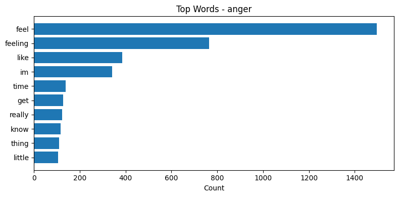
> </p>
>
> <p align='center'>
> 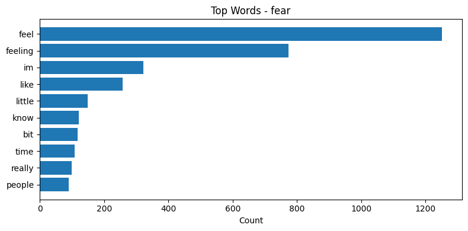
> </p>
>
> <p align='center'>
> 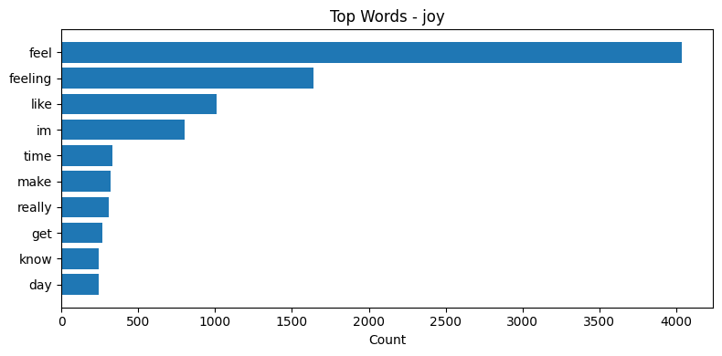
> </p>
>
> <p align='center'>
> 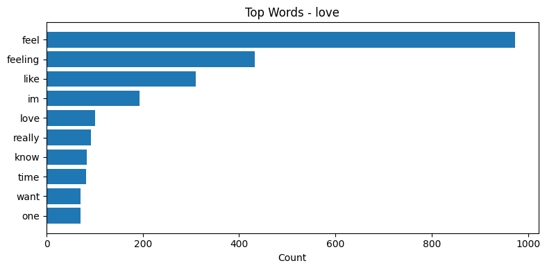
> </p>
>
> <p align='center'>
> 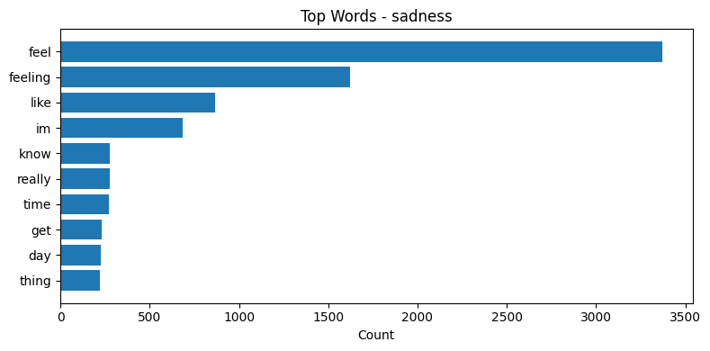
> </p>
>
> <p align='center'>
> 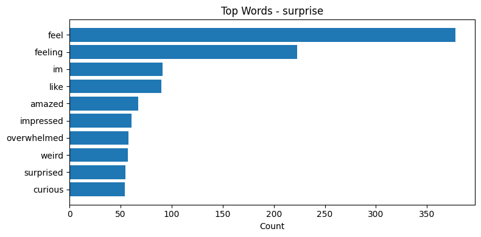
> </p>
>
> <br>
>
> **2. Bigrams**
> - Bigrams is 2 combined words pairs like "feel happy" and "not good". They work by counting how often each word pair appears in the data.
>
> - They are phrases that make an emotion linguistically distinct that gives a deeper meaning of the text itself.
>
> - In the output, the bigrams in "anger" emotion has distinctive word pairs like "feel angry" & "feel offended", while the "fear" emotion category has distinctive unique word pairs like "feel threatened" & "feeling pressured". Generic word pairs like "feel like" across all 6 emotions classes at different frequencies. The pattern shows each emotion has both shared word pairs and distinctive word pairs. This is what helps the model learn to classify emotion correctly.
>
> <p align='center'>
> 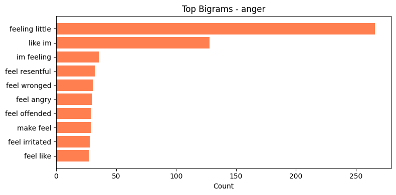
> </p>
>
> <p align='center'>
> 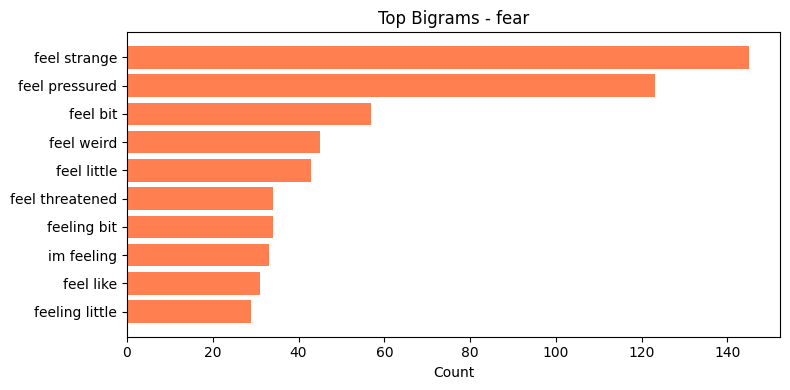
> </p>
>
> <p align='center'>
> 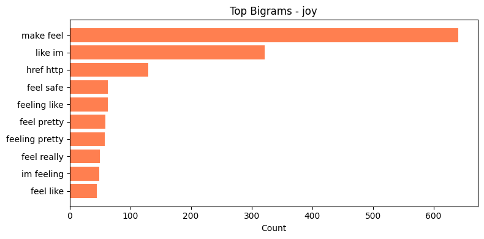
> </p>
>
> <p align='center'>
> 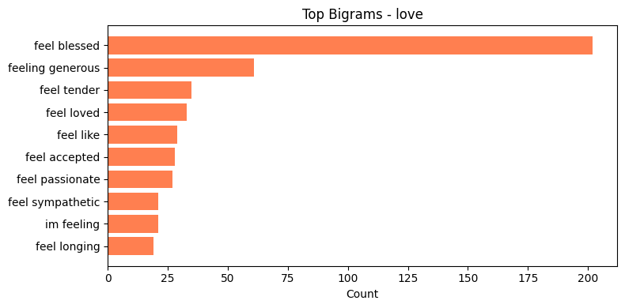
> </p>
>
> <p align='center'>
> 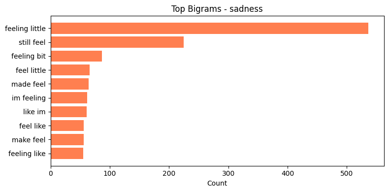
> </p>
>
> <p align='center'>
> 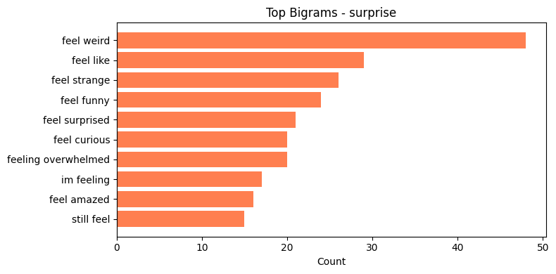
> </p>
>
> <br>
>
> **3. POS Tagging**
> - POS (Part-Of-Speech) tagging is the process of looking at each word (token) and automatically assigning a label to the corresponding grammatical category based on the context. POS Tagging Analysis then studies and evaluates these labels to find structural patterns and filter out noisy data.
>
> - Without POS Tagging, computers treat language as an unordered salad of words. POS tagging matters because it uncovers the grammar, structure, and hidden intent inside the raw text.
>
> - For example, linguistic analysis shows the basic grammar structure remains nearly identical regardless of the emotion being expressed. People form and use basic sentence patterns whether they are writing about anger, fear, joy or sadness.
>
> <div>
> <style scoped>
>    .dataframe tbody tr th:only-of-type {
>        vertical-align: middle;
>    }
>
>    .dataframe tbody tr th {
>        vertical-align: top;
>    }
>
>    .dataframe thead th {
>        text-align: right;
>    }
> </style>
> <table border="1" class="dataframe">
>  <thead>
>    <tr style="text-align: right;">
>      <th></th>
>      <th>Noun</th>
>      <th>Verb</th>
>      <th>Adjective</th>
>      <th>Adverb</th>
>    </tr>
>  </thead>
>  <tbody>
>    <tr>
>      <th>anger</th>
>      <td>44.1</td>
>      <td>27.0</td>
>      <td>19.4</td>
>      <td>9.5</td>
>    </tr>
>    <tr>
>      <th>fear</th>
>      <td>42.0</td>
>      <td>24.7</td>
>      <td>23.1</td>
>      <td>10.1</td>
>    </tr>
>   <tr>
>      <th>joy</th>
>      <td>44.0</td>
>      <td>24.5</td>
>      <td>22.3</td>
>      <td>9.3</td>
>    </tr>
>    <tr>
>      <th>love</th>
>      <td>45.0</td>
>      <td>25.6</td>
>      <td>20.3</td>
>      <td>9.1</td>
>    </tr>
>    <tr>
>      <th>sadness</th>
>      <td>42.0</td>
>      <td>27.1</td>
>      <td>21.0</td>
>      <td>9.9</td>
>    </tr>
>    <tr>
>     <th>surprise</th>
>      <td>41.0</td>
>      <td>28.0</td>
>      <td>21.1</td>
>      <td>9.9</td>
>    </tr>
>  </tbody>
> </table>
> </div>
>
><br>
>
> <p align='center'>
> 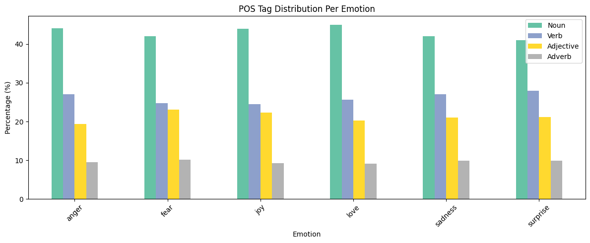
> </p>
>
> **How they Impacted the Model Performance:**
> - Previously, the original TF-IDF vectorizer, only accepts single words (unigrams) which meant two word phrases were ignored entirely. As a result, two-word phrases like 'feel angry' were broken into separate words, losing their combined meaning.
> - To improve the TF-IDF vectorizer, I added ```ngram_range=(1,2)``` which accepts both single words (unigrams) and two-word phrases (bigrams). This was necessary because some words only carry actual meaning in pairs - for example, expressing as a specific emotion like anger is lost when the words are treated as two seperate entities. Without implementing bigrams, these combined meanings would be lost and the model would misinterpret the sentiment.
>
> <p align='center'>
> 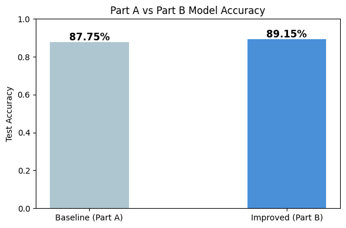
> </p>
>
>
>```python
>precision    recall  f1-score   support
>
>      anger       0.84      0.89      0.86       275
>       fear       0.88      0.79      0.83       224
>        joy       0.89      0.92      0.91       695
>       love       0.77      0.77      0.77       159
>    sadness       0.92      0.90      0.91       581
>   surprise       0.78      0.68      0.73        66
>
>   accuracy                           0.88      2000
>  macro avg       0.85      0.83      0.83      2000
>weighted avg       0.88      0.88      0.88      2000
>
> ==================================================
> Evaluation & Metrics Complete
> ==================================================
>```
>
>```python
> ==================================================
>  Part B - Task 5: Classification Report
> ==================================================
>
>              precision    recall  f1-score   support
>
>       anger       0.89      0.86      0.87       275
>        fear       0.88      0.82      0.85       224
>         joy       0.91      0.94      0.92       695
>        love       0.80      0.77      0.78       159
>     sadness       0.92      0.94      0.93       581
>    surprise       0.75      0.64      0.69        66
>
>    accuracy                           0.89      2000
>   macro avg       0.86      0.83      0.84      2000
> weighted avg       0.89      0.89      0.89      2000
> ==================================================
> Classification Report loaded & done!
> ==================================================
>
> ==================================================
> Evaluation & Comparison Done
> ==================================================
>```
>
<br>

**The Author's Reflection:**

Date Created: 23 May 2026
>
> I am Zachary Ng and I am a 2nd year student in 3 years Higher NITEC in AI Applications. I am the author that created this learning log for Natural Language Processing and Author's Reflection.
>
> The objective of writing this Learning Log & Author's Reflection is to show my learning concepts and to honestly document my journey as a student coder in creating this project.
>
> Being a student coder in NLP module wasn't always most smooth sailing. Like any student coder, I faced challenges and made mistakes.
>
> Challenges that I faced was having to integrate both Part A & Part B and making Part B's model higher than the baseline, it was honestly quite trickier than I thought. Even creating a proper markdown file was something I had to learn from zero - something I did not expect to spend time on but ended up being useful. 
>
> When I am stuck and faced with challenges, I used Claude, a generative AI tool to give me some ideas on how to raise Part B's model higher. I made sure not to just copy whatever it gave me. I tested things out myself, run into error messages, fixed them and gradually understand why certain things worked and other did not. This is the process of trying, failing and bouncing back from setbacks is what taught me the most.
>
> Looking back, I managed to solve the problems that I am facing and I realised that being a coder is not always about getting the right answer or even a high accuracy score in the model. It is about the process - understanding what each step does and why it matters. I went into this module know very little knowledge about NLP and I came out of it actually understanding concepts like data preprocessing, model training and evaluation.
>
> It is not a perfect journey. There are moments where I wanted to give up. But I am glad that I managed pushed through. This project made me to be a more patient and independent learner.